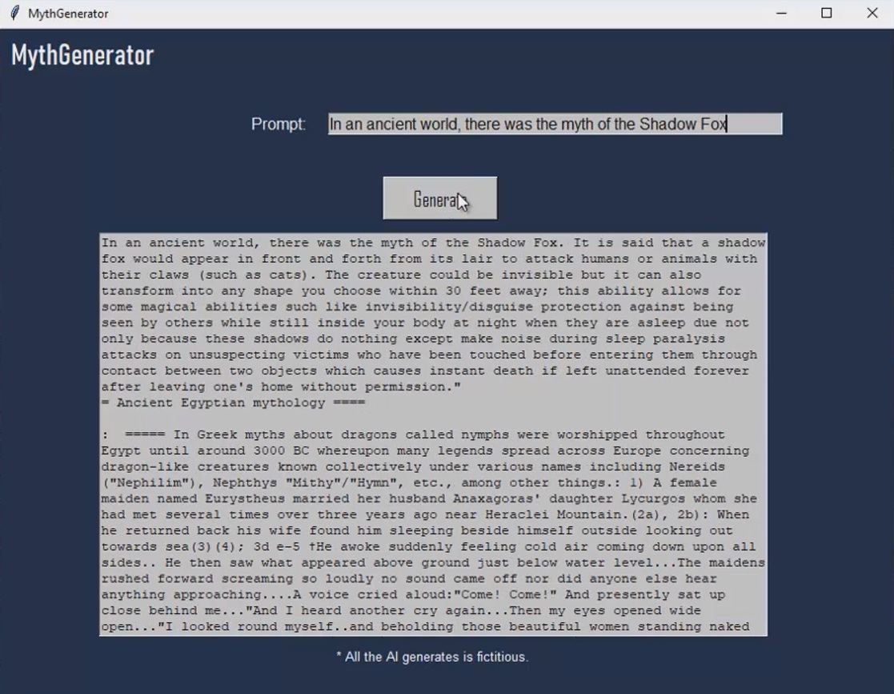

# 🐉 MythGenerator

**MythGenerator** is a text-generation AI project designed to create original mythological narratives based on user prompts.

The system was trained using a curated dataset of mythological creatures from multiple cultures around the world, allowing it to generate fictional myths inspired by ancient traditions, folklore structures, and symbolic motifs.

> ⚠️ All AI-generated content is fictional.

---

## 📌 Project Overview

The project began with the creation of an extensive list of mythological creatures from different cultures worldwide. Using ChatGPT, a total of **470 mythological entity names** were compiled.

Then:

- The **Wikipedia API** was used to extract English articles related to each creature.
- A filtering process ensured only relevant articles were included (e.g., containing terms like *"mythical"*).
- The dataset was reduced to **370 high-quality articles**.
- The content was structured and stored in JSON format for processing.
- The text was tokenized and formatted according to GPT-2 training specifications.
- Special tokens such as `USER` and `ASSISTANT` were added to help the model understand structure.
- The model was trained and fine-tuned to generate mythological text based on user prompts.

---

## 🖥️ Application Interface

The application provides a simple graphical interface:

- A prompt input field  
- A "Generate" button  
- A text output area where the generated myth appears  

Users can enter prompts such as:

> "In an ancient world, there was a myth of a cave wolf..."

And the model generates a fictional myth narrative based on that input.

---

## 🐺 Example 1 — Cave Wolf

Prompt:
> "In an ancient world, there was a myth of a cave wolf"

Generated output example:

---

## 🦊 Example 2 — Shadow Fox

Prompt:
> "In an ancient world, there was the myth of the Shadow Fox"

Generated output example:

---

## 🎥 Video Explanation (Spanish)

This repository includes a full video explanation in Spanish describing:

- The dataset creation process  
- The filtering methodology  
- The training pipeline  
- The final application  

You can watch it here:

👉 https://github.com/Fabri-D/MythGenerator/blob/master/MythGeneratorVideo.mp4

---

## 🧠 Technologies Used

- Python  
- Wikipedia API  
- GPT-2 fine-tuning  
- JSON data structuring  
- NLP preprocessing and tokenization  

---

## 📚 Purpose

MythGenerator is an experimental AI project that explores:

- Creative AI text generation  
- Cultural mythological structures  
- Data curation and model fine-tuning  
- Controlled fictional narrative generation  

It demonstrates how structured cultural datasets can be used to train generative language models for creative applications.

---

## ⚠️ Disclaimer

All content generated by MythGenerator is fictional and created by an AI model trained on publicly available mythological data.

